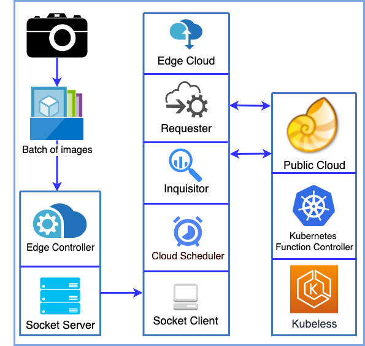

# STOIC

STOIC - Serverless Teleoperable Hybrid Cloud for Machine Learning Applications on Edge Device



* Create wtb inference pod on Nautilus
  
```bash
sh GPU_Serverless/kubeless/image_clf/inference/deploy.sh
```

* Run client on Mayhem cloud (edge cloud)

```bash
sh StartClient.sh
```

* Run server on Raspberry Pi at Sedgwick Natural Reserve

```bash
sh StartServer.sh
```
  
* Command Line Tool

```bash
./stoic run client --port 5001
```

```bash
./stoic run server --ip=127.0.0.1 --port=5001 --runtime=gpu2 --batch=3 --image=32 --preset=true
```

```bash
./stoic register -r "root-path-to-images"
```

* MySQL remove sudo for mysql -u root -p

Login with sudo:

```bash
sudo mysql -u root

ALTER USER 'root'@'localhost' IDENTIFIED WITH mysql_native_password BY 'test';
```
