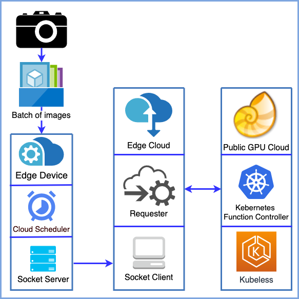

# STOIC

STOIC - Serverless Teleoperable Hybrid Cloud for Machine Learning Applications on Edge Device



* Create wtb inference pod on Nautilus
  
```bash
sh GPU_Serverless/kubeless/image_clf/inference/deploy.sh
```

* Run client on Mayhem cloud (Mini euca)

* Run server on Raspberry Pi at Sedgwick Natural Reserve
  